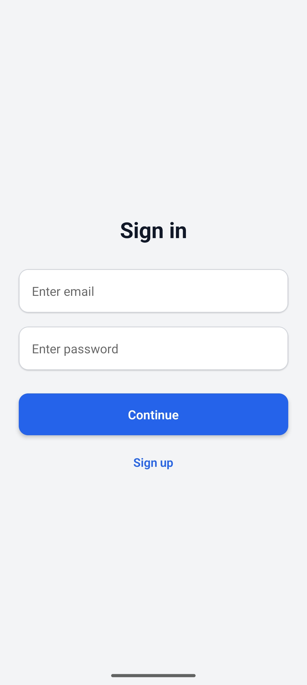
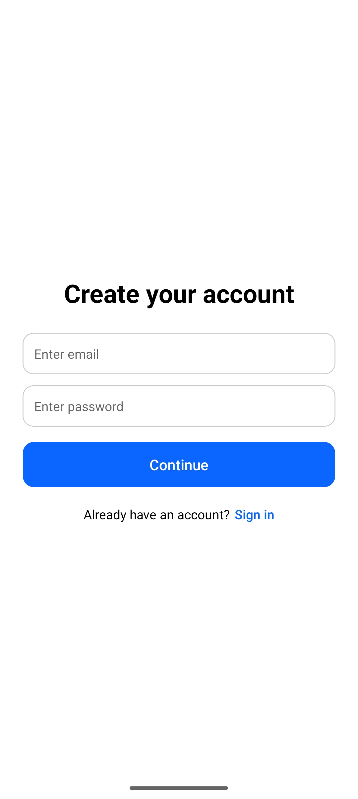
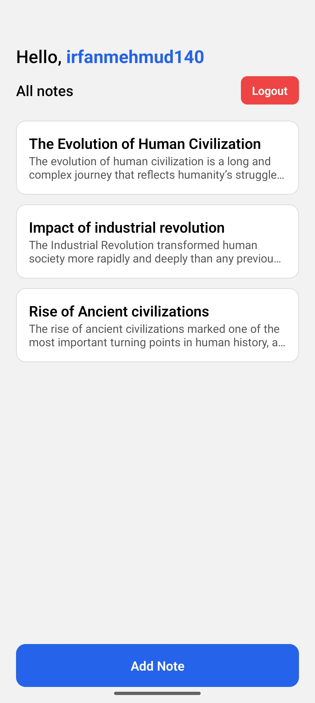
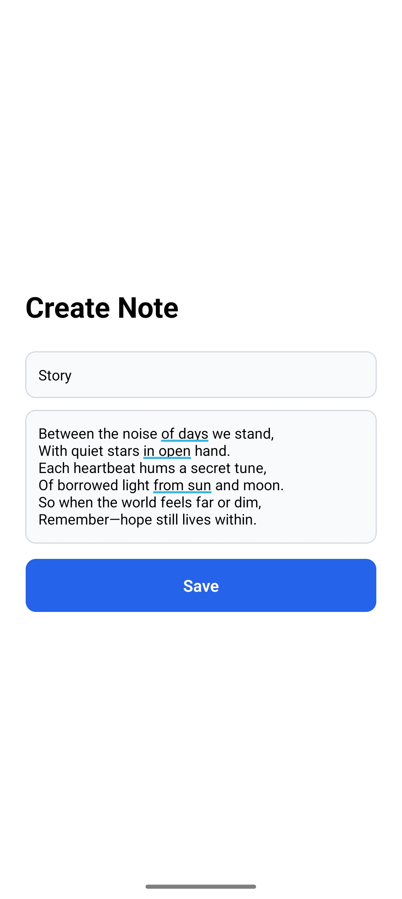
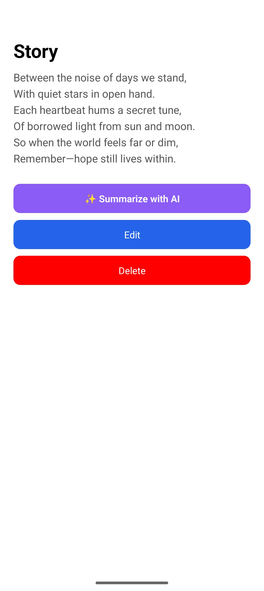
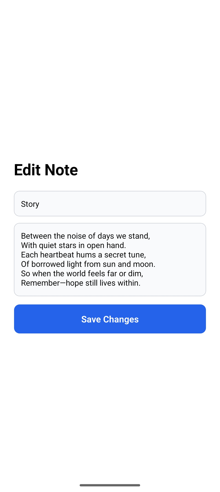
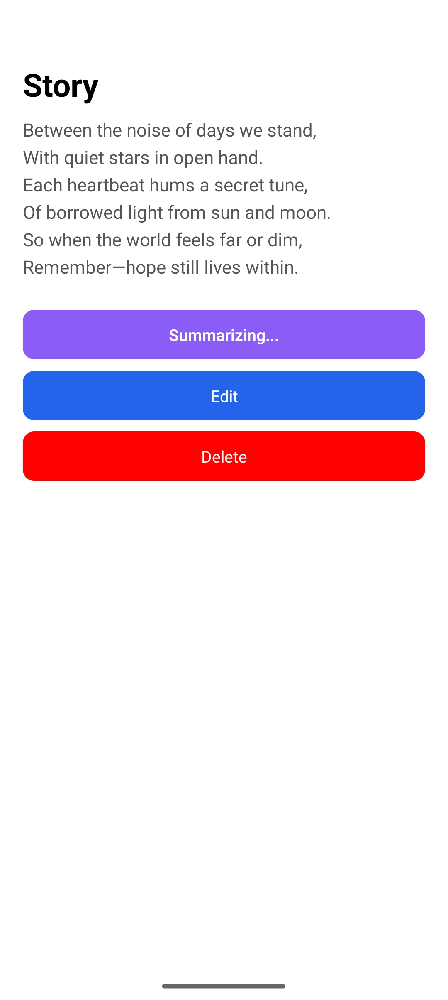
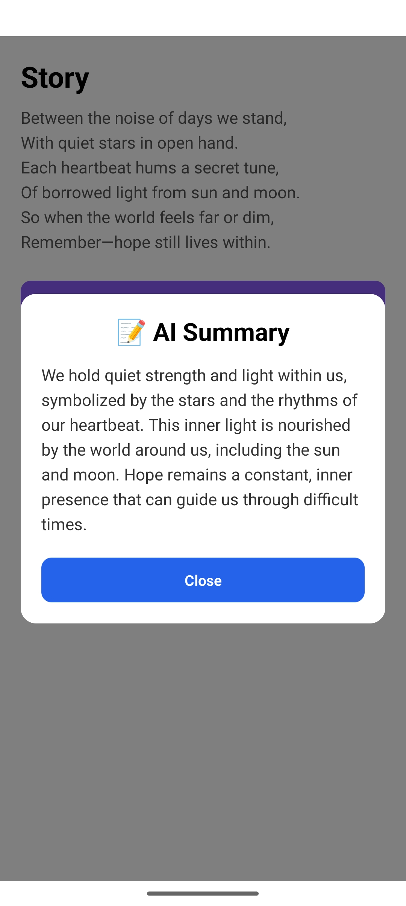

# NoteFlow

A full-stack note-taking application built with React Native (Expo), Bun + Express, and PostgreSQL. It includes Clerk authentication and AI-powered note summarization via a FastAPI microservice (Groq + LangChain).

## Features

- **User Authentication**: Secure authentication powered by Clerk
- **Create & Edit Notes**: Intuitive interface for note management
- **AI Note Summarization**: Summarize notes using LLaMA 3.3 via Groq, powered by a FastAPI microservice with LangChain
- **Real-time Sync**: Notes are synced with a PostgreSQL database
- **Microservice Architecture**: Separate Python AI service communicates with the Express backend via REST
- **Cross-Platform**: Mobile app runs on iOS, Android, and Web
- **Type-Safe**: Full TypeScript implementation across frontend and backend
- **Modern Stack**: Built with latest technologies and best practices

## 📋 Tech Stack

### Backend
- **Runtime**: Bun
- **Framework**: Express.js
- **Database**: PostgreSQL with Prisma ORM
- **Authentication**: Clerk Express SDK

### Python Server
- **Framework**: FastAPI
- **LLM**: LLaMA 3.3 70B via Groq
- **AI Orchestration**: LangChain (LCEL chains)
- **Validation**: Pydantic

### Mobile (Frontend)
- **Framework**: React Native with Expo
- **Navigation**: Expo Router
- **Authentication**: Clerk Expo SDK
- **HTTP Client**: Axios

## 📁 Project Structure

```
Note-App/
├── backend/                 # Express API server
│   ├── src/
│   │   ├── controllers/    # Route controllers
│   │   ├── services/       # Business logic
│   │   ├── routes/         # API routes
│   │   ├── middlewares/    # Custom middlewares
│   │   ├── config/         # Configuration files
│   │   └── types/          # TypeScript type definitions
│   ├── prisma/
│   │   └── schema.prisma   # Database schema
│   └── package.json
│
├── python-server/           # AI Summarization microservice
│   ├── src/
│   │   ├── config/         # Environment & settings
│   │   ├── routers/        # FastAPI route handlers
│   │   ├── services/       # LLM chain logic
│   │   ├── models/         # Pydantic schemas
│   │   └── main.py         # App entry point
│   ├── requirements.txt
│   └── pyproject.toml
│
└── mobile/                  # React Native mobile app
    ├── src/
    │   ├── app/            # Expo Router pages
    │   │   ├── (auth)/     # Authentication screens
    │   │   ├── (home)/     # Home screens
    │   │   └── note/       # Note-related screens
    │   ├── components/     # Reusable components
    │   ├── lib/            # Utilities and API client
    │   └── types/          # TypeScript type definitions
    └── package.json
```


## 📷 Screenshots

<table align="center">
  <tr>
    <td align="center"><br/><b>Sign In</b></td>
    <td align="center"><br/><b>Sign Up</b></td>
    <td align="center"><br/><b>Home</b></td>
  </tr>
  <tr>
    <td align="center"><br/><b>Create Note</b></td>
    <td align="center"><br/><b>View Note</b></td>
    <td align="center"><br/><b>Edit Note</b></td>
  </tr>
  <tr>
    <td align="center"><br/><b>Summarizing</b></td>
    <td align="center"><br/><b>AI Summary</b></td>
    <td></td>
  </tr>
</table>


## ✅ Prerequisites

- Docker Desktop
- Node.js + npm (for the Expo mobile app)

## 🚀 Getting Started

### 1. Clone the repository

```bash
git clone https://github.com/Irfan140/Note-App.git
cd Note-App
```

### 2. Run with Docker (recommended)

1) Create your env files (see “Environment Variables” below):

- `backend/.env` (Docker Compose)
- `python-server/.env`

2) Start services:

```bash
docker compose up -d
```

3) Run database migrations:

```bash
docker compose exec api bun run db:migrate
```

4) URLs:

- API: `http://localhost:5000`
- AI service: `http://localhost:8000`

Stop services:

```bash
docker compose down
```

Reset database volume:

```bash
docker compose down -v
```

### 3. Run the mobile app (Expo)

1) Create `mobile/.env` (see “Environment Variables” below)

2) Start Expo:

```bash
cd mobile
npm install
npm start
```

## 🗄️ Database Schema

The application uses two main models:

### User
- `id` (String): Clerk user ID
- `email` (String): User's email address
- `name` (String?): Optional user name
- `imageUrl` (String?): Optional profile image
- `notes` (Note[]): User's notes
- `createdAt` (DateTime): Account creation timestamp

### Note
- `id` (String): Unique note identifier (CUID)
- `title` (String): Note title
- `content` (String?): Optional note content
- `userId` (String): Foreign key to User
- `createdAt` (DateTime): Note creation timestamp

## 🔐 Environment Variables

### Backend (.env) (Docker Compose)
```env
DATABASE_URL="postgresql://postgres:postgres@db:5432/noteapp"
CLERK_PUBLISHABLE_KEY="pk_test_..."
CLERK_SECRET_KEY="sk_test_..."
AI_SERVICE_URL="http://ai:8000"
PORT=5000
```

### Python AI Server (.env)
```env
GROQ_API_KEY="gsk_..."
PORT=8000
```

### Mobile (.env)
```env
EXPO_PUBLIC_CLERK_PUBLISHABLE_KEY="pk_test_..."

# Docker Compose backend:
EXPO_PUBLIC_API_URL="http://localhost:5000"

# Physical phone (same network):
# EXPO_PUBLIC_API_URL="http://<your-local-ip>:5000"
```

## 📱 Available Scripts

### Backend
- `bun run dev` - Start development server with hot reload
- `bun run db:migrate` - Run database migrations

### Mobile
- `npm start` - Start Expo development server
- `npm run android` - Run on Android device/emulator
- `npm run ios` - Run on iOS device/simulator
- `npm run web` - Run in web browser
- `npm run lint` - Run ESLint

## 🏗️ API Endpoints

### Notes API (Express Backend)

- Base URL (Docker Compose): `http://localhost:5000`

Endpoints:
- `GET /notes` - Get all notes for authenticated user
- `GET /notes/:id` - Get a specific note
- `POST /notes` - Create a new note
- `PUT /notes/:id` - Update a note
- `DELETE /notes/:id` - Delete a note
- `POST /notes/:id/summarize` - Summarize a note using AI

All endpoints require Clerk authentication.

### AI Summarization API (Python Server — port 8000)
- `GET /` - Health check
- `GET /health` - Service health status
- `POST /summarize` - Summarize text content

The Express backend calls the Python server internally — the mobile app only talks to the Express backend.


## 👤 Author

**Irfan Mehmud**
- GitHub: [@Irfan140](https://github.com/Irfan140)